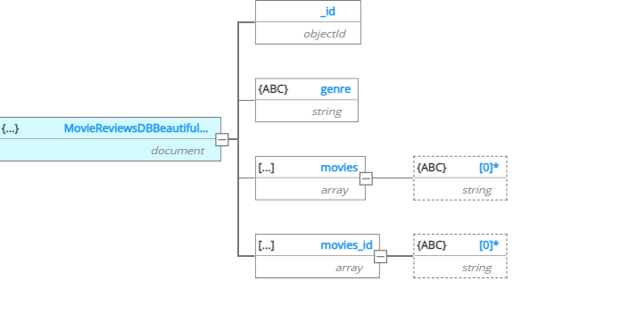
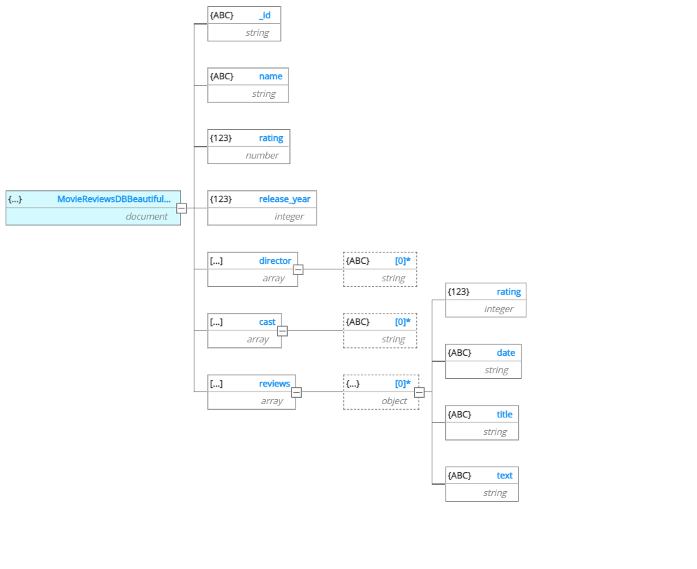

# IMDB Movies Scraper

This Scraper can get the genres availabe on the IMDB Website and scrape the Top 20 movies of each genre with their latest revies.

## Getting Started

The Project is based on Python and MongoDB so try to make sure you have both. :)

### Prerequisites
An Introduction to Python and NoSQL Databases would be good.
The following tools/softwares would be required
<ul>
 <li>Python 3.10.4
 <li>MongoDB 7.0.4
 <li> Python Libraries you need:
    <ul>
        <li> requests 2.31.0
        <li> beautifulsoup 4.11.1 
        <li> pymongo 4.6.1
        <li> Selenium 4.16.0 <i>(Optional)</i>
    </ul>
</ul>

Selenium is optional as it is not the main focus of this project, but if you want to scrape using selenium it is also an option.

### Installation

You can download and install Python and MongoDB from their respective websites.
<br>
For the libraries here's some tips:
<br>
You can install a specific version of a Python package using Pip by running the ```pip install <package_name>==<version>``` command
1. For requests:
```
pip install requests==2.31.0
```
2. For beautiful soup

```
pip install beautifulsoup4==4.11.1

```
3. For pymongo 
```
pip install pymongo==4.6.1 
```
4. For Selenium
```
pip install selenium==4.16.0
```
## Usage

Download the ``IMDB_BeautifulSoup_Scraper.py`` and ``main.py`` files.<br>
Check that the connection string on MongoDB compass and the ``main.py`` file are the same.<br>
You can simply run the main.py file to Scrape the IMDB Website getting the important information required.
You will get two collections namely, ``Genres`` and ``Movies`` containing the details.
<br>
<br>
For ``Using the Selenium Scraper`` just download the ``IMDB_Selenium_Scraper.py`` and in the import statement of ``main.py`` replace the  <strong>IMDB_BeautifulSoup_Scraper.py</strong> with <strong>IMDB_Selenium_Scraper.py</strong>


## Schema of the tables used

<br>
<p >Schema of Genre collection</p> <br>
<br>
<p>Schema of Movies collection</p>

## Important Consideration
<p>I have designed the database keeping in mind we have to do some data analysis and ML tasks. While we could have made the same database with SQL also, but SQL is rigid in comparison to NoSQL and NoSQL is memory effiecient too.</p>
<p>Keeping the efficiency in mind, I used BeautifulSoup, while the Selenium solution was easier to implement it was too much heavy on the processor and gpu as it loads like a real browser.</p>

## Challenges

The most challenging part for me was finding the parent tags for each part such that their attributes were unique and not randomly generated, For the selenium solution I used xpaths so, i did not have any problem locating the elements but using beautifulsoup, I had to go through multiple modifications for finding the right tag.

Even though I was not having any problem in the implementation of the database, but I was not sure as to which Database should I use, I ultimately went for the NoSQL solution, because first It was less rigid and is also more compatible with recent developements in the path of Big Data.


